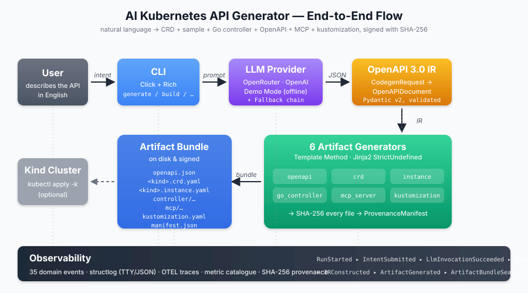

<p align="center">
  
</p>

# AI Kubernetes API Generator

> Transform a plain-English description into a complete, production-ready Kubernetes API
> — CRD, sample instance, OpenAPI spec, Go controller scaffold, MCP server, and
> kustomization — in under one second, with or without an internet connection.

<p align="center">
  
</p>

---

## What it does

You type:

```
"Create a PostgresCluster API with replicas (integer 1-7), storageGiB (integer),
 backupSchedule (string), and tlsEnabled (boolean)"
```

The tool produces a ready-to-use artifact bundle:

```
output/
├── openapi.json                                    ← OpenAPI 3.0 spec
├── postgrescluster.crd.yaml                        ← Kubernetes CRD (apiextensions/v1)
├── postgrescluster.instance.yaml                   ← Sample CR
├── kustomization.yaml                              ← kustomize overlay
├── controller/
│   ├── main.go                                     ← controller-runtime entry point
│   ├── go.mod
│   ├── Makefile
│   ├── Dockerfile
│   ├── api/v1alpha1/postgrescluster_types.go       ← typed API structs
│   └── internal/controller/postgrescluster_controller.go
├── mcp/
│   ├── server.py                                   ← MCP server scaffold
│   └── requirements.txt
└── manifest.json                                   ← SHA-256 provenance manifest
```

Apply it in one command:

```bash
kubectl apply -k output/
```

---

## Key features

| Feature | Detail |
|---|---|
| **Natural language input** | Describe any Kubernetes API in plain English |
| **Six artifact generators** | CRD, instance, OpenAPI, Go controller, MCP server, kustomization |
| **Demo mode (offline)** | 8 built-in scenarios — no API key required |
| **Live LLM mode** | OpenRouter or OpenAI for custom descriptions |
| **Idempotent output** | Same input → byte-identical output, every time |
| **SHA-256 provenance** | `manifest.json` checksums every generated file |
| **Hexagonal architecture** | Domain core + swappable adapters (20 ADRs, full DDD model) |
| **1 367 unit tests** | 62 golden tests, 25 performance benchmarks, strict mypy |

---

## Quick start

### Prerequisites

- **Python 3.11+**
- **pip** (or pipx)
- Docker + kind (optional — only needed to deploy to a local cluster)

### Install

```bash
git clone https://github.com/marcuspat/AI-Kubernetes-API-Generator-Demo.git
cd AI-Kubernetes-API-Generator-Demo
pip install -e ".[dev]"
```

### Run offline (demo mode — no API key needed)

```bash
python -m ai_platform_generator.adapters.cli.main \
  --llm-provider=demo \
  --no-deploy \
  --output-dir ./output \
  generate "Create a PostgresCluster API with replicas (integer 1-7), \
            storageGiB (integer), backupSchedule (string), and tlsEnabled (boolean)"
```

Exit 0 in ~50 ms. Check `./output/` for all generated artifacts.

### Run with a live LLM

```bash
export OPENROUTER_API_KEY="your-key-here"

python -m ai_platform_generator.adapters.cli.main \
  --llm-provider=openrouter \
  --no-deploy \
  --output-dir ./output \
  generate "Redis cluster with memoryGiB (integer 1-256), port (integer 1-65535), \
            and persistence (boolean)"
```

### Deploy to a local Kind cluster

```bash
./run.sh demo                          # installs kind, creates cluster, generates & applies CRDs
# or step by step:
./run.sh cluster-up
python -m ai_platform_generator.adapters.cli.main \
  --llm-provider=demo \
  --output-dir ./output \
  generate "..."
kubectl apply -k ./output/
```

---

## CLI reference

```
Usage: python -m ai_platform_generator.adapters.cli.main [OPTIONS] COMMAND [ARGS]...

Global options:
  --llm-provider [openrouter|openai|demo]   LLM backend (default: openrouter)
  --output-dir PATH                          Where to write generated files
  --no-deploy                                Skip cluster deployment stage
  --log-format [tty|json|quiet]              Output format (default: tty)

Commands:
  generate      Generate a Kubernetes API from a natural-language description
  examples      List the 8 built-in demo scenarios
  validate      Validate an existing CRD or OpenAPI document
  cluster       ensure | teardown | status — manage a local Kind cluster
  version       Print version information
```

### Built-in examples

```bash
python -m ai_platform_generator.adapters.cli.main examples
```

| Scenario | Kind | Group |
|---|---|---|
| postgres-cluster | PostgresCluster | database.cnoe.io |
| redis-cluster | RedisCluster | cache.cnoe.io |
| vector-db | VectorDB | ai.platform.cnoe.io |
| notebook | Notebook | datascience.cnoe.io |
| database-backup | DatabaseBackup | database.cnoe.io |
| cache-cluster | CacheCluster | platform.cnoe.io |
| monitoring-service | MonitoringService | observability.cnoe.io |
| ml-pipeline | MLPipeline | ai.platform.cnoe.io |

---

## Configuration

| Variable | Description | Required |
|---|---|---|
| `OPENROUTER_API_KEY` | OpenRouter API key | Only for live mode |
| `OPENAI_API_KEY` | OpenAI API key | Only if `--llm-provider=openai` |
| `AI_AGENT_REDACT_PATTERNS` | Extra regex patterns to redact from logs | No |

No API key is needed in demo mode.

---

## Testing

```bash
# Linting and type checking
python -m ruff check src/ tests/
python -m mypy src/ai_platform_generator/ --strict

# Unit and golden tests (no external dependencies)
python -m pytest tests/unit/ tests/golden/ -q

# E2E offline tests
python -m pytest tests/e2e/ -q -k "not cluster and not live"

# Performance benchmarks
python -m pytest tests/performance/ --benchmark-sort=mean
```

All gates pass on a clean checkout with no credentials configured.

---

## Architecture overview

The system is built around a **hexagonal (ports & adapters)** architecture with
six **Domain-Driven Design bounded contexts**:

```
Natural language
      │
      ▼
┌─────────────────────┐
│  Intent             │  Parses the description into a structured CodegenRequest
│  Interpretation     │  (LLM provider is a swappable port)
└────────┬────────────┘
         │ CodegenRequest
         ▼
┌─────────────────────┐
│  API Modelling      │  Builds a validated OpenAPI 3.0 Intermediate Representation
└────────┬────────────┘
         │ OpenAPIDocument (IR)
         ▼
┌─────────────────────┐
│  Artifact           │  Runs six generators (Template Method) → ArtifactBundle
│  Generation         │  + SHA-256 ProvenanceManifest
└────────┬────────────┘
         │ ArtifactBundle
         ▼
┌─────────────────────┐
│  Cluster            │  Applies CRD + instance to a Kind or remote cluster
│  Provisioning       │  (skipped with --no-deploy)
└─────────────────────┘

Supporting contexts:
  User Interaction   — Click CLI, Rich TTY renderer, JSON renderer
  Observability      — Structured logs, OTEL traces, metric catalogue
```

All 20 architectural decisions are documented in [`docs/adr/`](docs/adr/README.md).
The full domain model is in [`docs/ddd/`](docs/ddd/README.md).

---

## Documentation

| Document | Purpose |
|---|---|
| [`docs/adr/README.md`](docs/adr/README.md) | Architecture Decision Record index (ADR-0001 – ADR-0020) |
| [`docs/ddd/README.md`](docs/ddd/README.md) | Domain-Driven Design overview and reading order |
| [`docs/use-case-guide.md`](docs/use-case-guide.md) | Persona-based guide — who this is for and how to use it |
| [`docs/VALIDATION_REPORT.md`](docs/VALIDATION_REPORT.md) | v1.0.0 release validation report with GO verdict |
| [`docs/validation-report.md`](docs/validation-report.md) | Earlier gate validation report (lint, types, tests, benchmarks) |
| [`docs/cli-validation-report.md`](docs/cli-validation-report.md) | Comprehensive per-command CLI validation with captured I/O |
| [`docs/RELEASE_PROCEDURE.md`](docs/RELEASE_PROCEDURE.md) | Reusable release runbook (works for v1.1, v2.0, …) |
| [`RELEASE_NOTES.md`](RELEASE_NOTES.md) | v1.0.0 release notes |

---

## How it works

1. **Describe** — write a natural-language description of your Kubernetes API.
2. **Interpret** — the LLM (or demo catalogue) extracts the GVK and field schema.
3. **Model** — the IR Builder constructs a validated OpenAPI 3.0 document.
4. **Generate** — six generators run in order, each producing artifact files.
5. **Seal** — `manifest.json` is written with SHA-256 checksums for every file.
6. **Deploy** — (optional) the CRD + instance are applied to a Kind cluster.

Every stage emits **domain events** captured in structured JSON logs. The same
event stream feeds the OTEL trace hierarchy, the metric catalogue, and the
provenance manifest.

---

## Contributing

1. Fork and create a feature branch.
2. Any new architectural decision → add an ADR in `docs/adr/`.
3. Any new domain concept → update `docs/ddd/02-ubiquitous-language.md`.
4. Run `make lint test` before opening a PR.
5. All PRs require ADR references if they change architectural intent.

See [`CONTRIBUTING.md`](CONTRIBUTING.md) for the full process.

---

## License

MIT License — see [`LICENSE`](LICENSE) for details.

---

Built on [Pydantic v2](https://docs.pydantic.dev/), [Click](https://click.palletsprojects.com/),
[Rich](https://github.com/Textualize/rich), [Jinja2](https://jinja.palletsprojects.com/),
and [structlog](https://www.structlog.org/). Follows
[OpenAPI 3.0](https://swagger.io/specification/) and
[Kubernetes CRD structural schema](https://kubernetes.io/docs/tasks/extend-kubernetes/custom-resources/custom-resource-definitions/) conventions.
