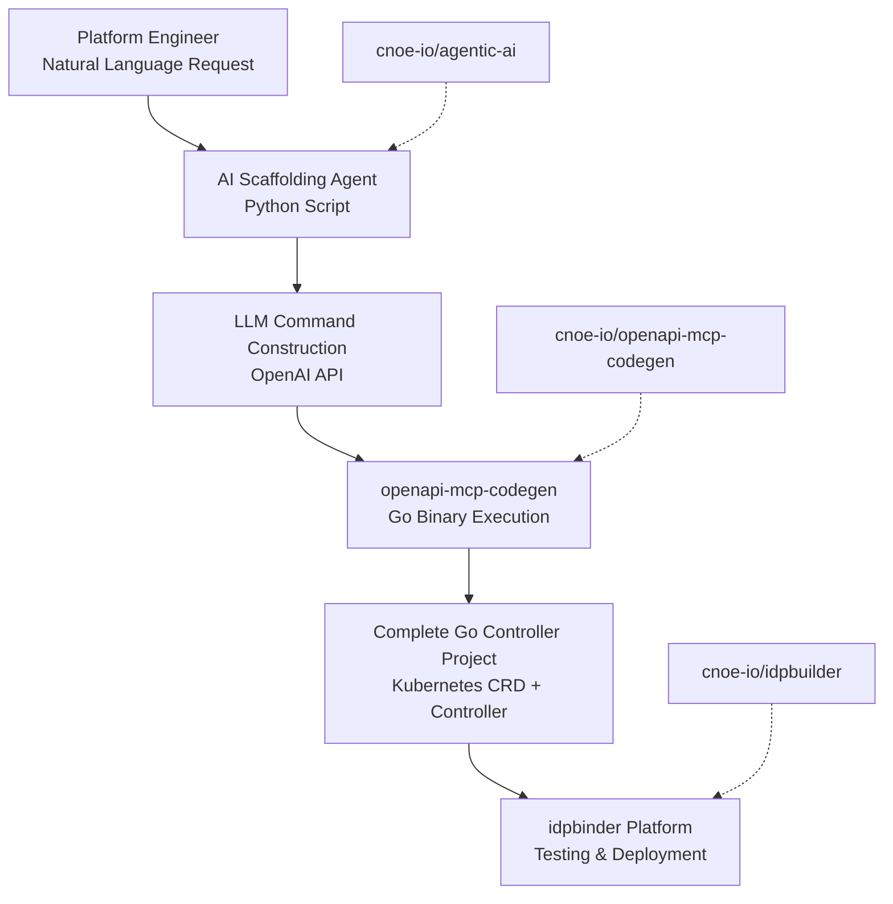

# AI-Assisted Platform Extension Generator: Comprehensive Documentation Plan

## Executive Summary

**Project**: AI scaffolding agent for Kubernetes platform development acceleration
**Methodology**: SPARC (Specification, Pseudocode, Architecture, Refinement, Completion)
**Target**: Natural language to openapi-mcp-codegen command translation with Go project generation
**Integration Points**: cnoe-io/openapi-mcp-codegen, cnoe-io/agentic-ai, cnoe-io/idpbuilder

## Architecture Overview



## Phase 0: Foundation & Environment Setup

### Objective
Establish development environment with all prerequisites, tooling, and repository clones for production-ready AI agent development.

### Current State Analysis
- **Existing**: Node.js/TypeScript project structure with Playwright testing
- **Missing**: Python environment, Go toolchain, external repository clones
- **Integration Points**: Package.json shows build/test infrastructure ready
- **Verification Needed**: All external repository accessibility and API endpoints

### Atomic Task Breakdown (TDD Methodology)

#### Foundation Tasks (00a-00z)
**task_00a_setup_python_environment.md**
- **Test**: Verify Python 3.9+ available and virtual environment creation
- **Implementation**: Create venv, install openai package, requirements.txt
- **Verification**: `python --version`, `pip list | grep openai`

**task_00b_setup_go_toolchain.md**
- **Test**: Verify Go 1.19+ installation and GOPATH configuration
- **Implementation**: Install Go, configure environment, test basic compilation
- **Verification**: `go version`, `go env`, test hello world compilation

**task_00c_clone_external_repositories.md**
- **Test**: Verify repository cloning and basic functionality
- **Implementation**: Clone cnoe-io repositories, verify structure, build binaries
- **Verification**: Repository existence, build success, basic command execution

**task_00d_configure_api_keys.md**
- **Test**: Verify OpenAI API key validation and connection
- **Implementation**: Environment variable setup, API connection test, error handling
- **Verification**: API test call, proper error handling for invalid keys

**task_00e_setup_project_structure.md**
- **Test**: Verify proper directory structure following CLAUDE.md
- **Implementation**: Create src/, tests/, docs/, config/, examples/ directories
- **Verification**: Directory creation, proper permissions, structure validation

#### Development Environment Tasks (01-09)
**task_01f_devcontainer_configuration.md**
- **Test**: Verify development container starts with all tools
- **Implementation**: Create .devcontainer with Python, Go, Docker, repository pre-clones
- **Verification**: Container startup, tool availability, repository access

**task_02g_dependency_management.md**
- **Test**: Verify all dependencies install correctly
- **Implementation**: Setup requirements.txt, go.mod, package.json updates
- **Verification**: Clean install success, version locking, security scanning

**task_03h_ci_pipeline_setup.md**
- **Test**: Verify CI pipeline runs all checks
- **Implementation**: GitHub Actions with Python, Go, integration tests
- **Verification**: Pipeline execution, artifact generation, test coverage

## Phase 1: External Repository Integration

### Objective
Integrate with cnoe-io/openapi-mcp-codegen and verify all API endpoints, command structures, and integration patterns.

### Integration Analysis
- **Primary Target**: cnoe-io/openapi-mcp-codegen command-line interface
- **Command Structure**: `--output-dir`, `--go-header-file`, `--input-spec` parameters
- **Input Format**: JSON spec with group, version, kind, spec properties
- **Output**: Complete Go controller project with CRD, controller, Dockerfile

### Atomic Task Breakdown

#### Repository Analysis Tasks (10-19)
**task_10a_analyze_codegen_api.md**
- **Test**: Verify openapi-mcp-codegen command structure and options
- **Implementation**: Execute help command, parse output, document parameter requirements
- **Verification**: Command execution, parameter validation, output structure analysis

**task_11b_test_basic_code_generation.md**
- **Test**: Verify simple VectorDB API generation works
- **Implementation**: Execute sample command, inspect output, validate project structure
- **Verification**: Generated files, Go compilation, CRD validation

**task_12c_analyze_agentic_ai_framework.md**
- **Test**: Verify agentic-ai framework integration points
- **Implementation**: Analyze framework patterns, identify extension points
- **Verification**: Framework documentation, sample agent creation, integration testing

**task_13d_explore_idpbuilder_integration.md**
- **Test**: Verify idpbuilder platform compatibility
- **Implementation**: Test generated controller in idpbuilder environment
- **Verification**: Controller deployment, CRD registration, basic functionality

#### API Integration Tasks (20-29)
**task_20e_command_builder_interface.md**
- **Test**: Verify command construction from JSON input
- **Implementation**: Create command builder module with validation
- **Verification**: Input validation, command generation, parameter escaping

**task_21f_output_analyzer.md**
- **Test**: Verify generated project analysis and validation
- **Implementation**: Create output parser to validate generated code structure
- **Verification**: Project structure validation, file existence checks, syntax validation

**task_22g_error_handling_integration.md**
- **Test**: Verify proper error handling for invalid inputs
- **Implementation**: Create comprehensive error handling for API failures
- **Verification**: Error scenarios, graceful degradation, user-friendly messages

## Phase 2: AI Agent Development

### Objective
Build production-ready AI scaffolding agent using Python with OpenAI integration, following TDD methodology with no mocks or stubs.

### Agent Architecture
```python
class AICodegenAgent:
    def __init__(self):
        self.openai_client = OpenAI()
        self.system_prompt = SYSTEM_PROMPT
        self.command_builder = CommandBuilder()
        self.output_analyzer = OutputAnalyzer()

    def process_request(self, user_request: str) -> AgentResponse:
        # Real LLM integration - no mocks
        pass

    def execute_command(self, command: List[str]) -> ExecutionResult:
        # Real subprocess execution - no stubs
        pass
```

### Atomic Task Breakdown

#### Core Agent Tasks (30-39)
**task_30a_system_prompt_engineering.md**
- **Test**: Verify system prompt produces correct JSON output format
- **Implementation**: Craft comprehensive system prompt with examples and constraints
- **Verification**: Multiple test inputs, JSON validation, output consistency

**task_31b_openai_client_integration.md**
- **Test**: Verify real OpenAI API connection and response handling
- **Implementation**: Create OpenAI client wrapper with error handling and retries
- **Verification**: API calls, response parsing, error scenarios, rate limiting

**task_32c_request_parser.md**
- **Test**: Verify natural language request parsing accuracy
- **Implementation**: Create request analyzer using LLM for structured extraction
- **Verification**: Complex requests, edge cases, ambiguous inputs, validation

**task_33d_command_constructor.md**
- **Test**: Verify accurate command construction from parsed data
- **Implementation**: Build command generator with proper parameter formatting
- **Verification**: Parameter escaping, path handling, JSON structure, validation

#### Agent Features Tasks (40-49)
**task_40e_interactive_interface.md**
- **Test**: Verify CLI interface with proper input/output handling
- **Implementation**: Create interactive CLI with prompts, validation, progress indicators
- **Verification**: User input, command-line options, output formatting, error display

**task_41f_batch_processing.md**
- **Test**: Verify batch processing of multiple requests
- **Implementation**: Add batch mode for processing multiple API requests
- **Verification**: Batch input parsing, parallel processing, result aggregation

**task_42g_configuration_management.md**
- **Test**: Verify configuration file handling and defaults
- **Implementation**: Create config system for defaults, custom settings, profiles
- **Verification**: Config loading, validation, defaults, overrides, environment variables

## Phase 3: Code Generation Integration

### Objective
Integrate AI agent with openapi-mcp-codegen for seamless natural language to Go project generation with validation and error handling.

### Integration Flow
1. Natural language input → LLM parsing
2. Parsed data → Command construction
3. Command execution → Go project generation
4. Output validation → Project analysis
5. Success feedback → User notification

### Atomic Task Breakdown

#### Command Integration Tasks (50-59)
**task_50a_command_execution_engine.md**
- **Test**: Verify safe subprocess execution with proper error handling
- **Implementation**: Create command executor with security, timeout, and validation
- **Verification**: Command execution, error capture, timeout handling, security validation

**task_51b_output_directory_management.md**
- **Test**: Verify output directory creation and management
- **Implementation**: Create directory manager with collision handling and cleanup
- **Verification**: Directory creation, permission handling, collision resolution, cleanup

**task_52c_boilerplate_integration.md**
- **Test**: Verify boilerplate file integration and customization
- **Implementation**: Integrate boilerplate.go.txt from cloned repository
- **Verification**: Boilerplate file access, template customization, integration testing

**task_53d_project_validation.md**
- **Test**: Verify generated project validation and compilation
- **Implementation**: Create project validator with Go compilation and linting
- **Verification**: Go compilation, linting, structure validation, dependency checking

#### Advanced Integration Tasks (60-69)
**task_60e_custom_template_support.md**
- **Test**: Verify custom template injection and modification
- **Implementation**: Add template system for custom project modifications
- **Verification**: Template loading, injection, validation, output verification

**task_61f_multi_resource_generation.md**
- **Test**: Verify generation of multiple related resources
- **Implementation**: Support for complex APIs with multiple kinds and relationships
- **Verification**: Multi-kind APIs, relationship validation, dependency resolution

**task_62g_integration_testing.md**
- **Test**: Verify end-to-end integration testing
- **Implementation**: Create comprehensive integration test suite
- **Verification**: End-to-end workflows, real API calls, validation checkpoints

## Phase 4: Testing & Validation

### Objective
Comprehensive testing strategy covering unit tests, integration tests, and end-to-end validation with real systems.

### Testing Strategy
- **Unit Tests**: Individual component testing with real dependencies
- **Integration Tests**: API integration with external systems
- **End-to-End Tests**: Complete workflow validation
- **Performance Tests**: Load testing and optimization
- **Security Tests**: Input validation and secure execution

### Atomic Task Breakdown

#### Unit Testing Tasks (70-79)
**task_70a_request_parsing_tests.md**
- **Test**: Comprehensive request parsing test suite
- **Implementation**: Test various natural language inputs and edge cases
- **Verification**: Test coverage, edge case handling, accuracy metrics

**task_71b_command_building_tests.md**
- **Test**: Command construction validation tests
- **Implementation**: Test command building with various API specifications
- **Verification**: Parameter validation, escaping, format validation

**task_72c_error_handling_tests.md**
- **Test**: Error handling and recovery tests
- **Implementation**: Test error scenarios and recovery mechanisms
- **Verification**: Error scenarios, graceful degradation, user experience

#### Integration Testing Tasks (80-89)
**task_80a_openai_integration_tests.md**
- **Test**: Real OpenAI API integration testing
- **Implementation**: Test with actual OpenAI API (with test keys)
- **Verification**: API connectivity, response handling, rate limiting

**task_81b_codegen_integration_tests.md**
- **Test**: openapi-mcp-codegen integration testing
- **Implementation**: Test with actual codegen tool and various inputs
- **Verification**: Tool integration, output validation, error handling

**task_82c_end_to_end_workflow_tests.md**
- **Test**: Complete workflow validation testing
- **Implementation**: Test full natural language to generated project workflow
- **Verification**: Workflow completion, output quality, user satisfaction

## Phase 5: Documentation & Deployment

### Objective
Comprehensive documentation, deployment automation, and user onboarding materials for production-ready release.

### Documentation Strategy
- **User Documentation**: Getting started guides, tutorials, examples
- **Developer Documentation**: API docs, contribution guidelines, architecture
- **Deployment Documentation**: Installation, configuration, CI/CD
- **Integration Documentation**: External system integration patterns

### Atomic Task Breakdown

#### Documentation Tasks (90-99)
**task_90a_user_guide_documentation.md**
- **Test**: Verify user guide completeness and accuracy
- **Implementation**: Create comprehensive user guide with examples
- **Verification**: Guide accuracy, example testing, user feedback

**task_91b_developer_documentation.md**
- **Test**: Verify developer documentation completeness
- **Implementation**: Create developer guide with architecture and contribution
- **Verification**: Documentation completeness, code examples, contribution flow

**task_92c_api_documentation.md**
- **Test**: Verify API documentation accuracy
- **Implementation**: Generate API documentation from code
- **Verification**: API documentation accuracy, example validation

#### Deployment Tasks (100+)
**task_100a_docker_deployment.md**
- **Test**: Verify Docker deployment and containerization
- **Implementation**: Create Docker images and deployment configurations
- **Verification**: Container build, deployment, runtime validation

**task_101b_ci_cd_pipeline.md**
- **Test**: Verify CI/CD pipeline deployment automation
- **Implementation**: Create automated deployment pipeline
- **Verification**: Pipeline execution, deployment validation, rollback testing

**task_102c_release_automation.md**
- **Test**: Verify release automation and versioning
- **Implementation**: Create release automation with semantic versioning
- **Verification**: Release process, version tagging, artifact publishing

## Success Criteria

### Technical Metrics
- **Code Coverage**: >90% for all critical components
- **Integration Success**: >95% successful API integrations
- **Build Success**: 100% successful builds and deployments
- **Performance**: <2 second response time for simple requests

### User Experience Metrics
- **Ease of Use**: Single command to generate complete project
- **Documentation Quality**: Comprehensive guides with examples
- **Error Handling**: Clear, actionable error messages
- **Flexibility**: Support for various API complexities

### Integration Metrics
- **Repository Integration**: Seamless integration with cnoe-io tools
- **Platform Compatibility**: Full idpbuilder platform support
- **API Reliability**: Robust handling of external API dependencies
- **Extensibility**: Framework for future enhancements

## Risk Assessment & Mitigation

### Technical Risks
- **OpenAI API Dependencies**: Rate limiting, cost management, reliability
- **External Repository Changes**: API changes, deprecation, breaking changes
- **Go Version Compatibility**: Toolchain updates, dependency conflicts

### Mitigation Strategies
- **API Rate Limiting**: Implement intelligent rate limiting and caching
- **Repository Pinning**: Version pinning and compatibility testing
- **Monitoring**: Comprehensive logging and monitoring
- **Fallback Mechanisms**: Graceful degradation and error recovery

## Conclusion

This comprehensive documentation plan provides a production-ready roadmap for building the AI-Assisted Platform Extension Generator using SPARC methodology and TDD principles. Each phase includes atomic, testable tasks that follow CLAUDE.md guidelines with no mocks or stubs, ensuring real, working code that integrates with actual systems.

The plan emphasizes:
- **Production-Ready Quality**: Real integrations, comprehensive testing
- **TDD Methodology**: Test-first development with no shortcuts
- **SPARC Workflow**: Systematic approach through all development phases
- **Integration Focus**: Seamless integration with cnoe-io ecosystem
- **User Experience**: Intuitive natural language interface with robust error handling