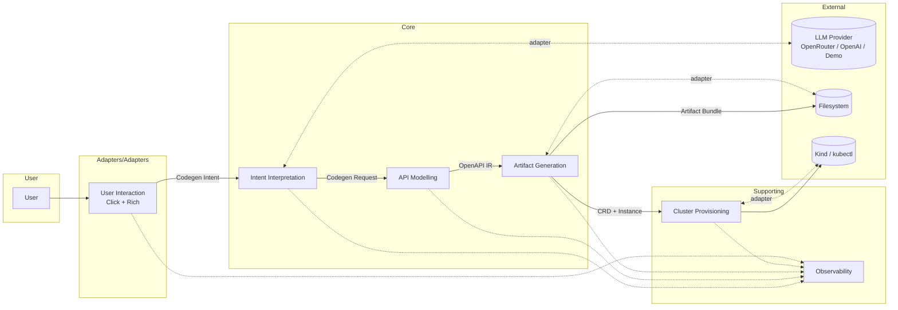

# 03 — Strategic Design

This document captures the **macro-level architecture** of the AI
Kubernetes API Generator: how the problem space is divided into
subdomains, how those subdomains are realised as bounded contexts, and
how the contexts collaborate.

The accompanying tactical model lives in
[`04-tactical-design.md`](04-tactical-design.md), and the deep dive into
each context lives under [`bounded-contexts/`](bounded-contexts/).

---

## 1. Subdomains

We classify subdomains using the standard DDD typology:

- **Core** — the differentiator; where the company invests heavily.
- **Supporting** — necessary but not differentiating; built in-house when
  off-the-shelf does not fit.
- **Generic** — solved problems; use third-party where possible.

| Subdomain                       | Type        | Why                                                                 |
| ------------------------------- | ----------- | ------------------------------------------------------------------- |
| **API Modelling**               | **Core**    | Translating intent into a high-fidelity, idempotent Kubernetes API spec is the unique value the product delivers. |
| **Intent Interpretation**       | **Core**    | The natural-language → structured-output pipeline (prompting, validation, fallback) is a key differentiator. |
| **Artifact Generation**         | Supporting  | Templates and renderers — important, but tractable engineering once the IR is right. |
| **Cluster Provisioning**        | Supporting  | Wraps existing tools (`kind`, `kubectl`) with our error model and lifecycle. |
| **User Interaction**            | Supporting  | CLI / TUI / future web UI; presentation only. |
| **Observability**               | Supporting  | Cross-cutting; built on third-party libraries but with domain-aware semantics. |
| **LLM Hosting**                 | Generic     | Outsourced to OpenRouter / OpenAI / similar. |
| **Container Runtime**           | Generic     | Outsourced to Docker. |
| **Source Control**              | Generic     | Outsourced to Git / GitHub. |

## 2. Bounded contexts

Each subdomain (other than the generics) is realised as one bounded
context, with its own ubiquitous language scope, its own aggregates, and
its own application services.

| #   | Bounded context                | Subdomain               | Owns                                                                                       |
| --- | ------------------------------ | ----------------------- | ------------------------------------------------------------------------------------------ |
| 1   | **Intent Interpretation**      | Intent Interpretation   | LLM provider port, prompt templates, demo mode, response parsing, intent validation        |
| 2   | **API Modelling**              | API Modelling           | OpenAPI IR aggregate, schema mapping, structural-schema validation                         |
| 3   | **Artifact Generation**        | Artifact Generation     | `ArtifactGenerator` Template Method, concrete generators, provenance, idempotency          |
| 4   | **Cluster Provisioning**       | Cluster Provisioning    | Cluster lifecycle, kubeconfig handling, deployment & verification                           |
| 5   | **User Interaction**           | User Interaction        | Click commands, Rich rendering, prompts, progress streams                                  |
| 6   | **Observability**              | Observability           | Telemetry sinks, secret redaction, audit trails                                            |

Cross-cutting:

- **Generation Orchestrator** is *not* its own context — it is an
  application service that lives at the seam, sequencing the contexts
  above. It owns no aggregates of its own; it consumes events and invokes
  application services.
- **Validation** is also cross-cutting; each context performs its own
  validation, but a shared error taxonomy ([ADR-0016](../adr/0016-validation-pipeline-error-model.md))
  unifies them.

## 3. Context map

### Integration patterns (DDD context-map vocabulary)

| Upstream                  | Downstream                | Pattern                       | Explanation                                                                                                                  |
| ------------------------- | ------------------------- | ----------------------------- | ---------------------------------------------------------------------------------------------------------------------------- |
| Intent Interpretation     | API Modelling             | **Customer / Supplier**       | API Modelling is the customer; Intent Interpretation must satisfy its needs. Both teams share the `CodegenRequest` schema.   |
| API Modelling             | Artifact Generation       | **Conformist** (downstream)   | Artifact Generation conforms to whatever IR API Modelling emits.                                                              |
| Artifact Generation       | Cluster Provisioning      | **Customer / Supplier**       | Cluster Provisioning consumes a stable artefact contract (CRD + instance file paths).                                         |
| User Interaction          | All core/supporting       | **Open Host Service**         | The CLI exposes a stable command surface that all contexts plug into via application services.                                |
| Observability             | All other contexts        | **Shared Kernel**             | The `DomainEvent` envelope and error-code vocabulary are shared across all contexts.                                          |
| External LLM Providers    | Intent Interpretation     | **Anti-Corruption Layer**     | The `LlmProvider` port plus per-vendor adapters keep provider quirks out of the domain. See [`07-anti-corruption-layers.md`](07-anti-corruption-layers.md). |
| External Filesystem       | Artifact Generation       | **Anti-Corruption Layer**     | The `ArtifactRepository` port wraps `pathlib` and the OS.                                                                     |
| External Kubernetes tools | Cluster Provisioning      | **Anti-Corruption Layer**     | The `ClusterRuntime` port wraps `kind` and `kubectl`.                                                                          |
| External Telemetry        | Observability             | **Conformist**                | We conform to OpenTelemetry semantic conventions where applicable.                                                            |

## 4. Team topologies

While the project is small enough today to be owned by a single team,
the intended *Conway-aligned* split is:

- **Core team** — owns the Intent Interpretation, API Modelling, and
  Artifact Generation contexts. Sets the IR.
- **Platform team** — owns Cluster Provisioning, Observability, and
  release engineering ([ADR-0019](../adr/0019-versioning-release-and-packaging.md)).
- **Frontend team** — owns User Interaction. Today this is the CLI; later
  it could be a TUI or web UI.

Cross-team contracts are exactly the public surfaces listed in
[`06-application-services.md`](06-application-services.md) and the events
in [`05-domain-events.md`](05-domain-events.md).

## 5. Architectural principles

The strategic design rests on five principles:

1. **Single intent, many artefacts.** The IR is computed once and consumed
   by many generators. ([ADR-0004](../adr/0004-openapi-3-as-intermediate-representation.md))
2. **Fail at the boundary.** Bad input is rejected at the context that
   first sees it; downstream contexts trust their callers.
3. **Domain code is portable.** No third-party SDK appears in `domain/` or
   `application/`. ([ADR-0014](../adr/0014-hexagonal-ports-and-adapters.md))
4. **Honesty over magic.** Demo mode declares itself; provenance is
   recorded; the user sees the same artefacts the system sees.
5. **Idempotent by default.** Two runs on the same input produce
   byte-identical artefacts. ([ADR-0013](../adr/0013-filesystem-as-artifact-store.md))

## 6. What lives outside the model

A handful of concerns are explicitly *not* part of any bounded context —
they are infrastructure or product wrapping:

- The shell entrypoint (`run.sh`) and OS-level installation of `kubectl` /
  `kind`.
- Project-management artefacts: README, LICENSE, SECURITY.md.
- Static-analysis configuration (`pyproject.toml`, `mypy.ini`, `ruff.toml`).
- Release pipelines.

Decisions affecting these surfaces still need ADRs but do not produce
domain concepts.
