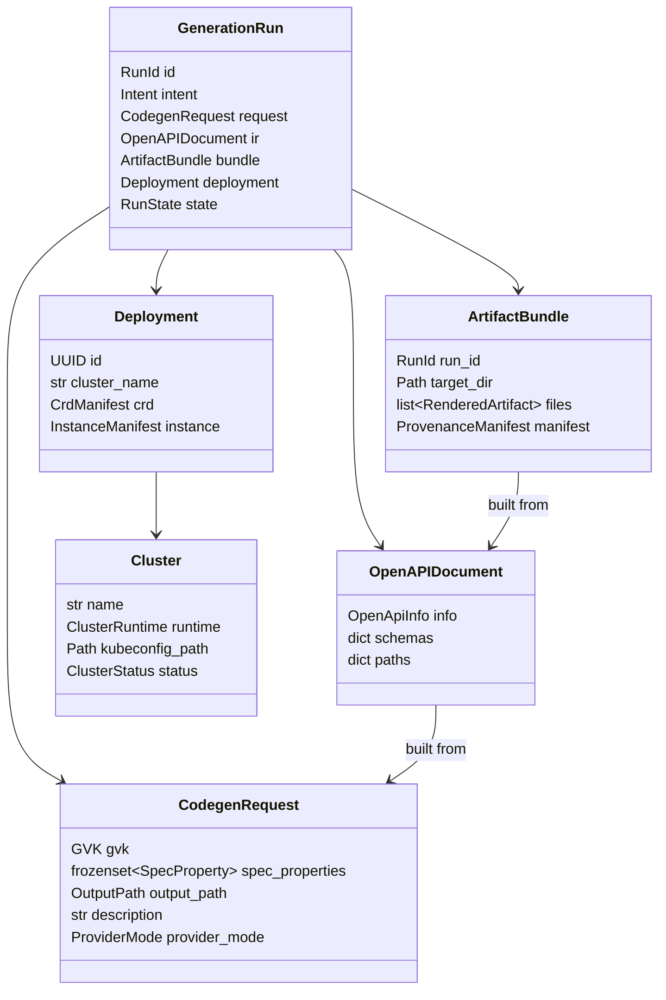

# 04 — Tactical Design

This document maps the strategic decomposition from
[`03-strategic-design.md`](03-strategic-design.md) onto concrete DDD
tactical patterns: **value objects**, **entities**, **aggregates**,
**domain services**, **factories**, and **repositories**.

It uses the **Ubiquitous Language** of
[`02-ubiquitous-language.md`](02-ubiquitous-language.md) verbatim. Where
implementation hints are useful, illustrative Python signatures are
shown. The signatures are normative *as contracts*, not as exact code.

---

## 1. Building-block legend

| Pattern             | Discriminator                                                                            |
| ------------------- | ---------------------------------------------------------------------------------------- |
| **Value Object**    | Immutable, equality by value, no identity. `frozen=True` dataclass or Pydantic.          |
| **Entity**          | Has identity that persists across mutations.                                             |
| **Aggregate**       | A graph of entities + value objects with a single root that enforces invariants.         |
| **Aggregate Root**  | The only entity in an aggregate that the outside world references by ID.                  |
| **Domain Service**  | Stateless logic that is not natural on any single aggregate.                              |
| **Repository**      | Persistence-port for an aggregate, in domain terms.                                       |
| **Factory**         | Constructs aggregates that are non-trivial to assemble correctly.                         |
| **Domain Event**    | A past-tense fact emitted by an aggregate.                                                |

---

## 2. Value Objects (cross-context)

### 2.1 `Group`

```python
@dataclass(frozen=True)
class Group:
    value: str

    _RE = re.compile(r"^[a-z0-9.-]+\.[a-z0-9.-]+$")

    def __post_init__(self) -> None:
        if not self._RE.fullmatch(self.value):
            raise InvalidGroup(self.value)

    def __str__(self) -> str:
        return self.value
```

Invariants: reverse-DNS, lowercase, no leading/trailing dot, no double
dots.

### 2.2 `Version`

```python
@dataclass(frozen=True)
class Version:
    value: str
    _RE = re.compile(r"^v\d+(?:(?:alpha|beta)\d+)?$")

    def __post_init__(self) -> None:
        if not self._RE.fullmatch(self.value):
            raise InvalidVersion(self.value)

    @property
    def stability(self) -> Literal["alpha", "beta", "ga"]:
        if "alpha" in self.value: return "alpha"
        if "beta"  in self.value: return "beta"
        return "ga"
```

### 2.3 `Kind`

```python
@dataclass(frozen=True)
class Kind:
    value: str
    _RE = re.compile(r"^[A-Z][A-Za-z0-9]*$")

    def __post_init__(self) -> None:
        if not self._RE.fullmatch(self.value):
            raise InvalidKind(self.value)

    @property
    def plural(self) -> str:
        # English-language pluralisation good enough for CRDs:
        v = self.value.lower()
        if v.endswith("s"): return v + "es"
        if v.endswith("y"): return v[:-1] + "ies"
        return v + "s"
```

### 2.4 `GVK`

```python
@dataclass(frozen=True)
class GVK:
    group: Group
    version: Version
    kind: Kind

    @property
    def crd_name(self) -> str:
        return f"{self.kind.plural}.{self.group}"
```

### 2.5 `SpecProperty`

```python
@dataclass(frozen=True)
class SpecProperty:
    name: str          # camelCase, JSON-identifier-safe
    type: PropertyType # see below
    description: str
    constraints: PropertyConstraints  # min/max, pattern, enum...
```

### 2.6 `PropertyType` (enum)

```
string | integer | number | boolean | array<string|integer|number|boolean> | object
```

The generator rejects unsupported types at the **Validation Stage**
([ADR-0016](../adr/0016-validation-pipeline-error-model.md)).

### 2.7 `PropertyConstraints`

A frozen dataclass holding optional `minimum`, `maximum`, `min_length`,
`max_length`, `pattern`, `enum`, `format`. Each combination is validated
against `PropertyType`.

### 2.8 `OutputPath`

```python
@dataclass(frozen=True)
class OutputPath:
    root: Path     # validated absolute, inside an allow-listed prefix
    relative: Path # path traversal-checked
```

### 2.9 `Checksum`

```python
@dataclass(frozen=True)
class Checksum:
    algorithm: Literal["sha256"]
    value: str  # 64 lowercase hex chars

    def matches(self, payload: bytes) -> bool: ...
```

### 2.10 `ProviderMode`

```python
class ProviderMode(StrEnum):
    LIVE = "live"
    DEMO = "demo"
```

### 2.11 `RunId`

A UUIDv7 (time-ordered) value identifying a Generation Run.

---

## 3. Entities

### 3.1 `GenerationRun` *(entity, lives at the orchestrator layer)*

```python
class GenerationRun:
    id: RunId
    started_at: datetime
    intent: Intent             # value object — raw user input
    request: CodegenRequest | None
    ir: OpenAPIDocument | None
    bundle: ArtifactBundle | None
    deployment: Deployment | None
    state: RunState             # see below
```

```
RunState = pending | interpreting | modelling | generating
         | persisting | provisioning | verifying | succeeded | failed
```

State transitions are guarded; only the `GenerationOrchestrator`
application service may transition them.

### 3.2 `Cluster` *(entity, owned by Cluster Provisioning)*

```python
class Cluster:
    name: str               # identity
    runtime: ClusterRuntime # adapter reference
    kubeconfig_path: Path
    nodes: list[NodeName]
    status: ClusterStatus
```

### 3.3 `Deployment` *(entity, owned by Cluster Provisioning)*

```python
class Deployment:
    id: UUID
    cluster_name: str
    crd: CrdManifest
    instance: InstanceManifest
    crd_applied: bool
    instance_applied: bool
    verified_at: datetime | None
```

---

## 4. Aggregates

### 4.1 `CodegenRequest` *(aggregate root — Intent Interpretation context)*

| Field             | Type                       |
| ----------------- | -------------------------- |
| `gvk`             | `GVK`                      |
| `spec_properties` | `frozenset[SpecProperty]`  |
| `output_path`     | `OutputPath`               |
| `description`     | `str` (≤ 1024 chars)       |
| `provider_mode`   | `ProviderMode`             |

Invariants enforced in `__post_init__`:

1. `gvk.group`, `gvk.version`, `gvk.kind` all valid (delegated to value
   objects).
2. `spec_properties` non-empty.
3. Every `SpecProperty.name` is unique within the aggregate.
4. Every `SpecProperty.name` is a legal JSON identifier.
5. `description` is non-empty after stripping.

The aggregate is **immutable**. To "modify" a request, produce a new one
via `CodegenRequest.with_*` builders.

Domain events emitted at construction:

- `CodegenRequestParsed(run_id, gvk, property_count, provider_mode)`

### 4.2 `OpenAPIDocument` *(aggregate root — API Modelling context)*

| Field         | Type                                |
| ------------- | ----------------------------------- |
| `info`        | `OpenApiInfo` (title, version, ...) |
| `schemas`     | `dict[str, JsonSchema]`             |
| `paths`       | `dict[str, PathItem]` (currently empty for CRDs) |
| `extensions`  | `dict[str, Any]`                    |

Invariants:

1. The schema named after the request's `Kind` exists and is structural.
2. `apiVersion`, `kind`, `metadata`, `spec` are present in the `Kind`
   schema.
3. Every spec property in the source `CodegenRequest` appears under
   `spec.properties` with its declared type and constraints.

Factory: `OpenAPIDocument.from_request(request: CodegenRequest)`.

Events:

- `IRConstructed(run_id, schema_count)`
- `IRRejected(run_id, violations)`

### 4.3 `ArtifactBundle` *(aggregate root — Artifact Generation context)*

| Field         | Type                          |
| ------------- | ----------------------------- |
| `run_id`      | `RunId`                       |
| `target_dir`  | `Path`                        |
| `files`       | `list[RenderedArtifact]`      |
| `manifest`    | `ProvenanceManifest`          |

Where:

```python
@dataclass(frozen=True)
class RenderedArtifact:
    path: Path
    bytes: bytes
    mode: int
    artefact_type: ArtifactType  # CRD | Instance | OpenApi | GoController | McpServer
    checksum: Checksum

@dataclass(frozen=True)
class ProvenanceManifest:
    run_id: RunId
    tool_version: str
    git_sha: str
    generated_at: datetime
    request: CodegenRequest
    provider_mode: ProviderMode
    model_id: str | None
    files: list[ArtifactRef]   # path + checksum
```

Invariants:

1. `target_dir` is inside the allow-listed output root.
2. Each `RenderedArtifact.path` is unique within the bundle.
3. Each checksum matches its bytes.
4. `manifest.files` is the set of `(path, checksum)` of `files`.

Events:

- `ArtifactGenerated(run_id, artefact_type, path, checksum)`
- `ArtifactBundleSealed(run_id, manifest_checksum)`

### 4.4 `Cluster` aggregate (root: `Cluster` entity above)

Holds a list of recent `Deployment`s for verification queries. Invariant:
all deployments in the list belong to this cluster.

---

## 5. Domain Services

A domain service is stateless logic that is not naturally a method on any
aggregate.

| Service                          | Lives in              | Responsibility                                                                |
| -------------------------------- | --------------------- | ----------------------------------------------------------------------------- |
| `IntentParser`                   | Intent Interpretation | Wraps an `LlmProvider` port and produces a `CodegenRequest` from `Intent`.   |
| `RequestValidator`               | Intent Interpretation | Runs the syntactic + lexical + semantic stages from [ADR-0016](../adr/0016-validation-pipeline-error-model.md). |
| `RequestEnhancer`                | Intent Interpretation | Fills in safe defaults (`output_dir`, `description`).                         |
| `IRBuilder`                      | API Modelling         | Pure function `(CodegenRequest) -> OpenAPIDocument`.                          |
| `StructuralSchemaValidator`      | API Modelling         | Enforces Kubernetes' structural-schema rules.                                  |
| `ArtifactPlanner`                | Artifact Generation   | `(IR, target_dir) -> GenerationPlan`.                                          |
| `Renderer`                       | Artifact Generation   | Jinja2 template renderer with `StrictUndefined`.                              |
| `Idempotency Verifier`           | Artifact Generation   | Re-runs a generator and asserts byte-equivalence (golden tests).              |
| `DeploymentVerifier`             | Cluster Provisioning  | Runs `kubectl get` and parses the result into `DeploymentStatus`.             |
| `SecretRedactor`                 | Observability         | Scrubs telemetry payloads.                                                    |
| `ErrorTranslator`                | Observability         | Maps low-level exceptions to typed `PlatformGeneratorError`s.                 |

---

## 6. Repositories

Each repository is a port. Adapters live in
`adapters/` ([ADR-0014](../adr/0014-hexagonal-ports-and-adapters.md)).

### 6.1 `ArtifactRepository`

```python
class ArtifactRepository(Protocol):
    def save(self, bundle: ArtifactBundle) -> None: ...
    def load(self, run_id: RunId) -> ArtifactBundle: ...
    def exists(self, run_id: RunId) -> bool: ...
```

Default adapter: `FilesystemArtifactRepository`.

### 6.2 `RunRepository`

```python
class RunRepository(Protocol):
    def append(self, run: GenerationRun) -> None: ...
    def get(self, run_id: RunId) -> GenerationRun: ...
    def latest(self) -> GenerationRun | None: ...
```

Default adapter: an append-only JSONL file under `.platform-gen/runs.jsonl`
(future).

### 6.3 `ClusterRepository`

```python
class ClusterRepository(Protocol):
    def upsert(self, cluster: Cluster) -> None: ...
    def get(self, name: str) -> Cluster | None: ...
    def all(self) -> Iterable[Cluster]: ...
```

Default adapter: derived directly from `kind get clusters`.

---

## 7. Factories

Factories exist where construction is non-trivial and the validation
chain would otherwise be repeated.

| Factory                           | Builds                                                                 |
| --------------------------------- | ---------------------------------------------------------------------- |
| `CodegenRequestFactory`           | `CodegenRequest` from raw LLM JSON, applying defaults and translation. |
| `OpenAPIDocumentFactory`          | `OpenAPIDocument` from a `CodegenRequest`.                              |
| `RunFactory`                      | `GenerationRun` with a fresh `RunId`, timestamp, and initial state.    |
| `ProvenanceManifestFactory`       | `ProvenanceManifest` capturing tool/git/run metadata at sealing time.  |

---

## 8. Invariants summary

A short catalogue of cross-aggregate invariants. Violation of any of
these is a bug.

1. **Identity stability**: a `GenerationRun.id` is assigned at creation
   and never changes.
2. **GVK consistency**: every `OpenAPIDocument` and every artefact in the
   resulting `ArtifactBundle` references the exact `GVK` of the source
   `CodegenRequest`.
3. **Idempotency**: `OpenAPIDocument.from_request(r) == OpenAPIDocument.from_request(r)`
   byte-for-byte; `generator.generate(ir, dir)` produces byte-equal
   files for equal inputs.
4. **Provenance completeness**: every artefact in a bundle has a checksum
   in the `ProvenanceManifest`.
5. **Boundary discipline**: no domain class imports from `adapters/` or
   any third-party SDK ([ADR-0014](../adr/0014-hexagonal-ports-and-adapters.md)).
6. **Path safety**: all output paths resolve inside the configured root
   ([ADR-0020](../adr/0020-security-threat-model-and-hardening.md)).

---

## 9. Putting it together


