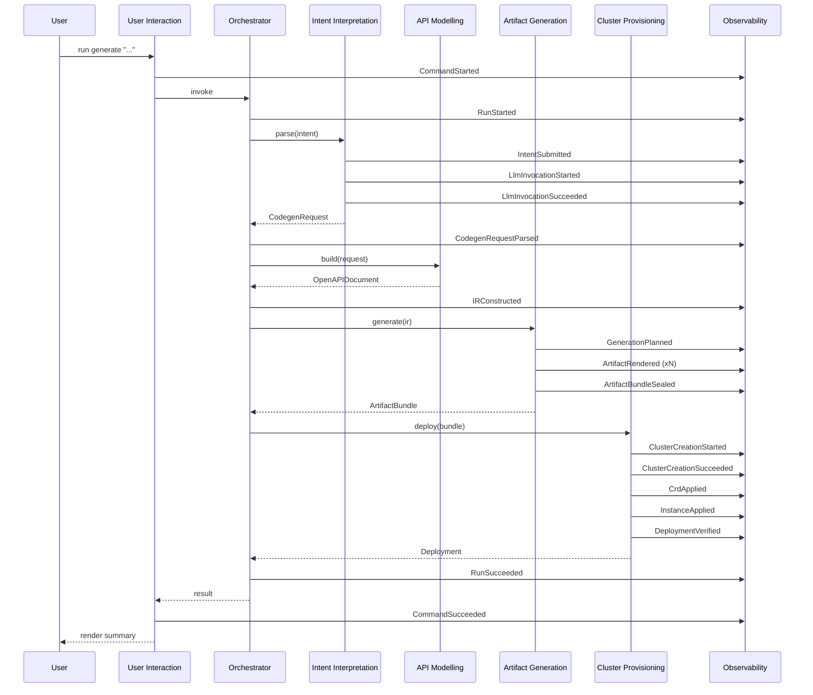

# 05 — Domain Events

This document catalogues the **domain events** in the AI Kubernetes API
Generator and shows how they flow through a Generation Run. Domain events
are the primary integration mechanism between bounded contexts (see
[`03-strategic-design.md`](03-strategic-design.md)).

---

## 1. Why domain events

- They give every context a uniform way to **announce significant state
  changes** without coupling to the listener.
- They are the substrate for the [Observability context](bounded-contexts/06-observability.md)
  — every event becomes a log line, a metric, and a span.
- They make the orchestration **saga** explicit and testable.

All events are:

- **Past tense.** They describe a fact that has occurred.
- **Immutable.** Once raised they are never amended.
- **Self-contained.** Carriers of all data needed by listeners; listeners
  never call back into the producer.
- **Versioned.** Each event has a stable `name` and a numeric
  `schema_version`.

---

## 2. Event envelope

```python
@dataclass(frozen=True)
class DomainEvent:
    event_id: UUID            # UUIDv7
    run_id: RunId             # binds the event to a Generation Run
    name: str                 # e.g. "CodegenRequestParsed"
    schema_version: int
    occurred_at: datetime
    context: str              # producing bounded context
    payload: Mapping[str, Any]
    causation_id: UUID | None # event that caused this one
```

Convention: payload keys use `snake_case`; values are JSON-serialisable.

---

## 3. Event catalogue

Events are organised by producing context.

### 3.1 Intent Interpretation

| Event                          | Payload                                                                                       | Meaning                                                                              |
| ------------------------------ | --------------------------------------------------------------------------------------------- | ------------------------------------------------------------------------------------ |
| `IntentSubmitted`              | `intent_text_hash`, `intent_length`                                                           | A user submitted a free-text intent.                                                  |
| `LlmInvocationStarted`         | `provider`, `model`, `mode`                                                                   | A request was sent to an LLM provider.                                               |
| `LlmInvocationSucceeded`       | `provider`, `model`, `mode`, `latency_ms`, `prompt_tokens`, `completion_tokens`               | The LLM returned a parseable response.                                               |
| `LlmInvocationFailed`          | `provider`, `model`, `mode`, `error_code`, `recoverable`                                       | The LLM call failed.                                                                  |
| `DemoModeEngaged`              | `reason_code`                                                                                  | The orchestrator fell back to demo mode.                                              |
| `CodegenRequestParsed`         | `gvk`, `property_count`, `provider_mode`                                                       | A `CodegenRequest` aggregate was constructed.                                         |
| `CodegenRequestRejected`       | `violations: list[FieldViolation]`                                                             | Validation rejected the parsed request.                                               |

### 3.2 API Modelling

| Event                | Payload                                                | Meaning                                                |
| -------------------- | ------------------------------------------------------ | ------------------------------------------------------ |
| `IRConstructed`      | `schema_count`, `extension_count`, `gvk`              | The OpenAPI IR was built.                              |
| `IRRejected`         | `violations: list[FieldViolation]`                    | Structural-schema validation failed.                   |

### 3.3 Artifact Generation

| Event                       | Payload                                                                                  | Meaning                                                              |
| --------------------------- | ---------------------------------------------------------------------------------------- | -------------------------------------------------------------------- |
| `GenerationPlanned`         | `generator`, `expected_paths`                                                            | A generator's `_plan` step produced a `GenerationPlan`.              |
| `ArtifactRendered`          | `generator`, `path`, `byte_size`, `checksum`                                             | A single file was rendered (in-memory).                              |
| `ArtifactPostProcessed`     | `path`, `processor`, `byte_size_after`                                                   | Post-processing (e.g. gofmt) completed.                              |
| `ArtifactGenerated`         | `artefact_type`, `path`, `checksum`                                                      | A single artefact has been produced and written.                     |
| `ArtifactBundleSealed`      | `manifest_checksum`, `file_count`, `target_dir`                                          | All artefacts are written and the provenance manifest is committed. |
| `ArtifactGenerationFailed`  | `generator`, `stage`, `error_code`                                                       | Generation failed at a specific stage.                                |

### 3.4 Cluster Provisioning

| Event                          | Payload                                                              | Meaning                                                              |
| ------------------------------ | -------------------------------------------------------------------- | -------------------------------------------------------------------- |
| `PrerequisiteCheckSucceeded`   | `tools: list[str]`                                                   | All required external tools are present.                              |
| `PrerequisiteCheckFailed`      | `missing: list[str]`                                                 | One or more tools are missing.                                       |
| `ClusterCreationStarted`       | `cluster_name`, `runtime`                                            | A cluster create command was issued.                                  |
| `ClusterCreationSucceeded`     | `cluster_name`, `runtime`, `nodes`, `duration_s`                     | The cluster is up and `kubectl get nodes` returns.                    |
| `ClusterCreationFailed`        | `cluster_name`, `error_code`, `duration_s`                            | The cluster failed to come up within the timeout.                    |
| `CrdApplied`                   | `cluster_name`, `crd_name`                                           | A CRD was applied successfully.                                      |
| `InstanceApplied`              | `cluster_name`, `gvk`, `instance_name`                               | A sample instance was applied successfully.                          |
| `DeploymentVerified`           | `cluster_name`, `gvk`, `instance_name`, `status`                     | `kubectl get` confirms the resource is queryable.                    |
| `DeploymentVerificationFailed` | `cluster_name`, `gvk`, `instance_name`, `error_code`                 | Verification could not confirm the deployment.                       |

### 3.5 User Interaction

| Event                  | Payload                                              | Meaning                                                  |
| ---------------------- | ---------------------------------------------------- | -------------------------------------------------------- |
| `CommandStarted`       | `command`, `argv_redacted`                           | A CLI command was invoked.                               |
| `CommandSucceeded`     | `command`, `duration_ms`                             | The command exited 0.                                    |
| `CommandFailed`        | `command`, `error_code`, `exit_code`                 | The command exited non-zero with a typed error.          |
| `RenderModeChosen`     | `mode` (`tty` / `json` / `quiet`)                    | The renderer detected an output mode.                    |

### 3.6 Orchestration / cross-cutting

| Event                            | Payload                                              | Meaning                                                  |
| -------------------------------- | ---------------------------------------------------- | -------------------------------------------------------- |
| `RunStarted`                     | `run_id`, `started_at`                               | A new Generation Run was opened.                         |
| `StageStarted`                   | `run_id`, `stage`                                    | The orchestrator entered a stage.                        |
| `StageSucceeded`                 | `run_id`, `stage`, `duration_ms`                     | The stage completed.                                     |
| `StageFailed`                    | `run_id`, `stage`, `error_code`, `recoverable`       | The stage failed.                                        |
| `CompensationApplied`            | `run_id`, `stage`, `action`                          | The orchestrator ran a compensating action.              |
| `RunSucceeded`                   | `run_id`, `duration_ms`                              | The Generation Run completed successfully.               |
| `RunFailed`                      | `run_id`, `duration_ms`, `error_code`                | The Generation Run aborted.                              |

---

## 4. End-to-end event flow

The canonical successful flow:



---

## 5. Event-storming summary

The strategic event-storming session that produced this catalogue
identified three **hot spots** (places where many events converge):

1. **Around `CodegenRequestParsed`** — almost every recovery path
   converges here (live success, demo fallback, retry-after-rate-limit).
2. **Around `ArtifactBundleSealed`** — the hand-off to Cluster
   Provisioning is gated on the bundle being on disk and verified.
3. **Around `RunFailed`** — compensating actions originate here.

Two **pivotal events** drive most of the saga's branching:

- `LlmInvocationFailed` decides whether the orchestrator retries, falls
  back to demo mode, or aborts.
- `DeploymentVerificationFailed` decides whether the orchestrator
  diagnoses the failure (missing CRD established condition) or aborts.

---

## 6. Subscriber expectations

- **Idempotent handling.** Subscribers must tolerate duplicate delivery
  (events may be replayed in tests).
- **Order within a run.** Events for a given `run_id` are delivered in
  the order they were raised.
- **Schema evolution.** Adding a payload field is non-breaking.
  Removing or renaming a field requires a `schema_version` bump and a
  migration note. Old subscribers must be tolerant of unknown fields.

---

## 7. Mapping to telemetry

Each event becomes:

- One **structured log line** (default sink), with `event=<name>`,
  `run_id`, and the full payload after redaction.
- One or more **metric updates** when the event maps to a known metric
  (see [ADR-0017](../adr/0017-observability-and-telemetry.md)).
- A **span event** on the active OTEL span (when OTEL is enabled).

Some events open or close a span:

| Event                                  | Span action       |
| -------------------------------------- | ----------------- |
| `RunStarted`                           | open `run` span   |
| `RunSucceeded` / `RunFailed`           | close `run` span  |
| `StageStarted`                         | open `stage` span |
| `StageSucceeded` / `StageFailed`       | close `stage` span |
| `LlmInvocationStarted`                 | open `llm` span   |
| `LlmInvocationSucceeded` / `LlmInvocationFailed` | close `llm` span |
| `ClusterCreationStarted`               | open `cluster.create` span |
| `ClusterCreationSucceeded` / `ClusterCreationFailed` | close `cluster.create` span |

Other events become **span events** (annotations on the surrounding span).
